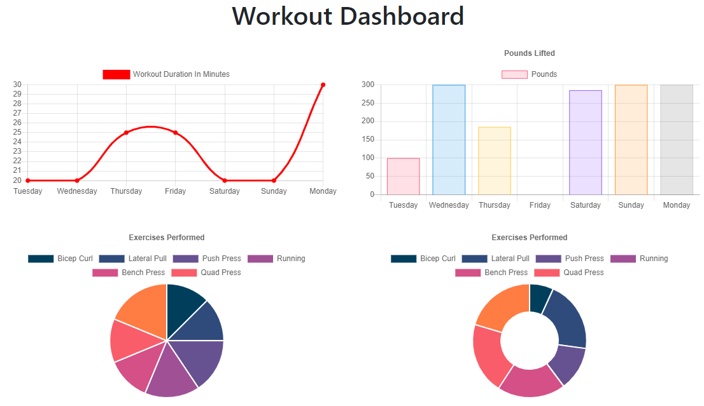
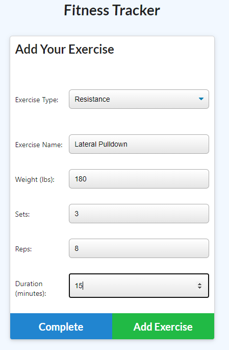

# Mongo Fitness Tracker

## Description
This [web application](https://enigmatic-ravine-40935.herokuapp.com/) deployed on Heroku allows users to save multiple workouts to a MongoDB Atlas database.


## Table of Contents
* [Technologies Used](#technologies-used)
* [How to Access](#how-to-access)
* [What I Did](#what-i-did)
* [Code Snippets](#code-snippets)
* [Screenshots](#screenshots)
* [Acknowledgments](#acknowledgments*)
* [Who I Am](#who-i-am)

---

## Technologies Used
* [Javascript](https://www.javascript.com/) to develop the logic and dynamically-generated HTML included in this web application.
* [Node.js](https://nodejs.org/en/docs/) to run this Javascript program in the terminal/Git Bash console during development.
* [Express](https://www.npmjs.com/package/express) for the use of shorthand methods for developing server code with Javascript.
* [MongoDB](https://www.mongodb.com/what-is-mongodb) as a document database for storing and querying data in the app.
* [Mongoose](https://mongoosejs.com/) as an ORM to manipulate the MongoDB database.
* [MySQL](https://www.mysql.com/) for peristent relational database structure.
* [Heroku CLI](https://devcenter.heroku.com/articles/heroku-cli) to use heroku commands in the terminal for deployment to Heroku.
* [Git](https://git-scm.com/) for distributed version control, tracking changes over time and making them visible to collaborators.
* [Github](https://github.com/) for version control in the cloud, saving my changes and presenting them clearly to myself and others.

## How to Access
This web application is hosted on Heroku, and can be [accessed here](https://enigmatic-ravine-40935.herokuapp.com/), and here: <https://enigmatic-ravine-40935.herokuapp.com/>

---

## What I Did
I utilized a backend Mongoose ORM to link a MongoDB database to Express GET/POST/PUT route handling. The HTML and API routes defined in `/routes/routes.js` are referenced by the frontend JavaScript that populates the HTML and handles event listening.

## Code Snippets 
The following code snippet shows an API route that gave me a good bit of trouble until I had sufficiently scoured the documentation for a solution. When the route is hit by `stats.js`, the request is expecting an array of objects received from a query to the Workout model. I used the .aggregate() method on the Workout model in order to utilize the Mongoose `$set` method, which adds a new field to a document while preserving all of the documents initial input fields in the promise. Within $set, I defined the key totalDuration and set it equal to the `$sum` of the *duration* ley values for each object in the *exercises* field.

From the resulting promise, I used the Mongoose .sort() method with the parameter of {day: 1} to sort the documents by day in ascending order. This query is then limited to the last seven results with the .limit() method. The resulting data that has been sorted and limited is finally returned as JSON to `stats.js` where the route was called.

```javascript
router.get("/api/workouts/range", (req, res) => {
    // this is called in stats.js, and the corresponding function is defined in api.js
    // sort by day, ascending, then return the data as JSON
    Workout.aggregate([{
        $set: {
            totalDuration: { $sum: "$exercises.duration" }
        }
    }]).sort({ day: 1 }).limit(7)
        .then(data => {
            res.json(data);
        })
        .catch(err => {
            console.log(err);
            res.json(err);
        });
});
```

## Screenshots
Example of the stats page:



Example of adding a new exercise:


---

## Acknowledgments
* [W3Schools](https://www.w3schools.com/) has been my go-to for descriptive tutorials on HTML, CSS, and Javascript syntax and best practices. I am eternally grateful for their massive store of documentation.
* [MDN Web Docs](https://developer.mozilla.org/en-US/) is another resource for documentation on HTML, CSS, and Javascript that I find myself using more and more often as I work through deeper Javascript.
* [Express](https://www.npmjs.com/package/express) deserves another round of thanks for being a really cool way to develop backend code in Javascript.
* [gstudioimagen](https://www.freepik.com/vectors/camera) for the free camera vector art.

## Who I Am
My name is Rand Hale, and I am an aspiring programmer/web developer based in California.

* [LinkedIn](https://www.linkedin.com/in/rand-hale-83ba389b/)
* [GitHub](https://github.com/prophetrand)